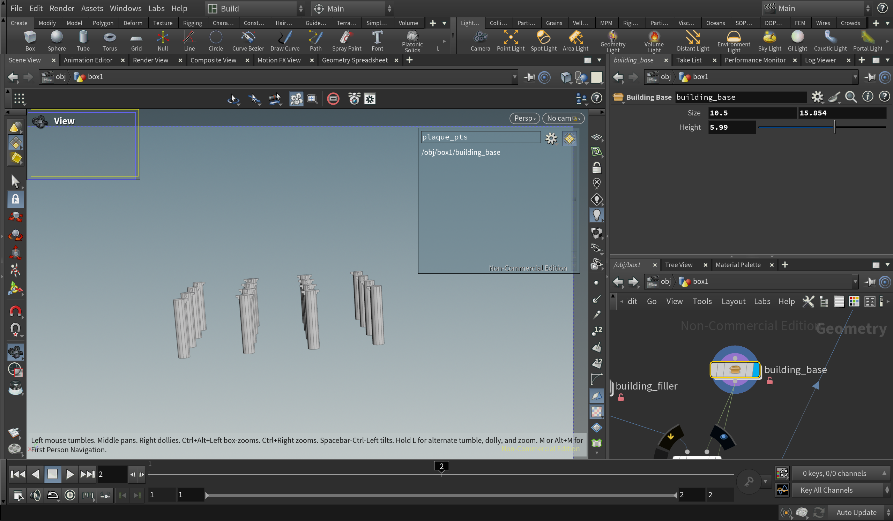
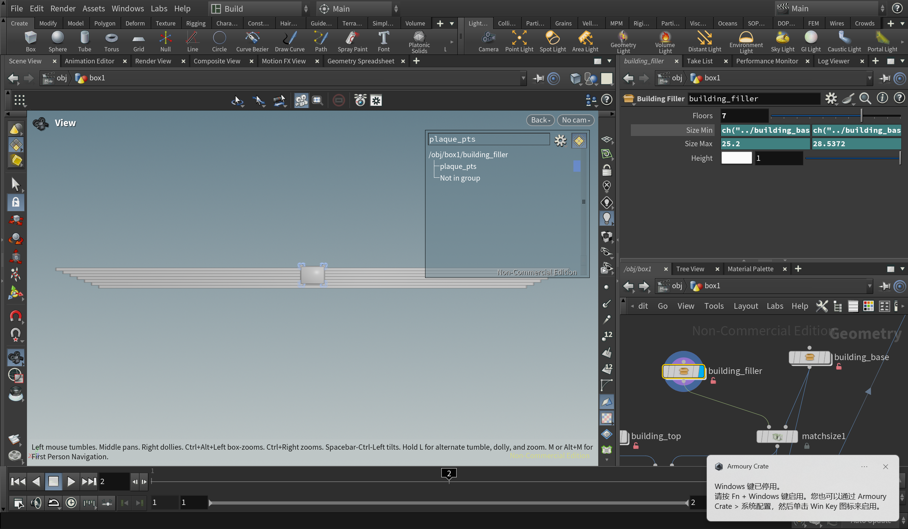
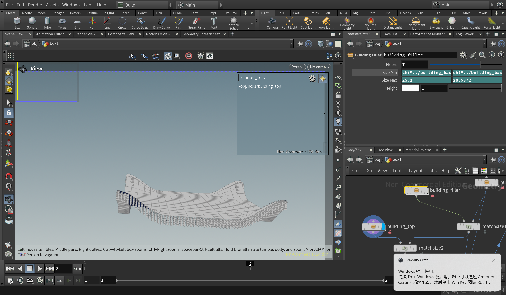

## Chinese Temple by PCG

I did a Chinese style temple like this because I think it's beautiful and quite symmetric that can be developed by PCG.

## Srt style

## Each part
### Bottom

I chose tube and modeled the little decoration between them.
The hard part is to get the right position of each decoration, so I do it using the grid that generates the tube,
and calculated some new points in the AttriWrangle. It is basically create two symmetric points for each middle points between two near points.

### Middle
I realized it based on the tutorial, but I squeezes it and make each layer a little bigger than below.

I also add a little decoration to it as the art style shows.

### Top
I used wrangle to generate the curvy plane and resampled its outline.Then I aligned pillars to it and merge the two model together.

## Result
